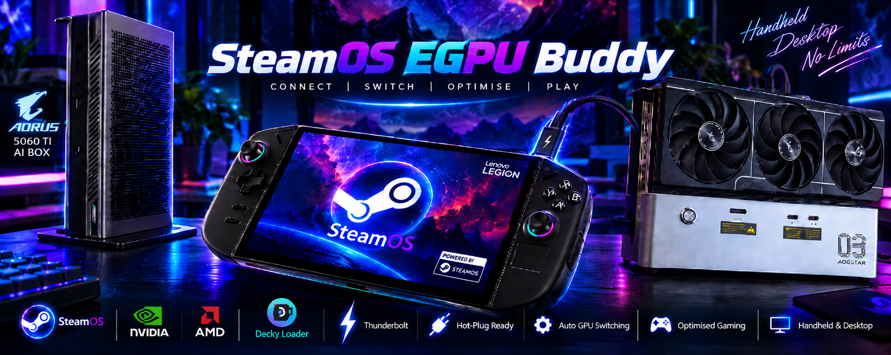
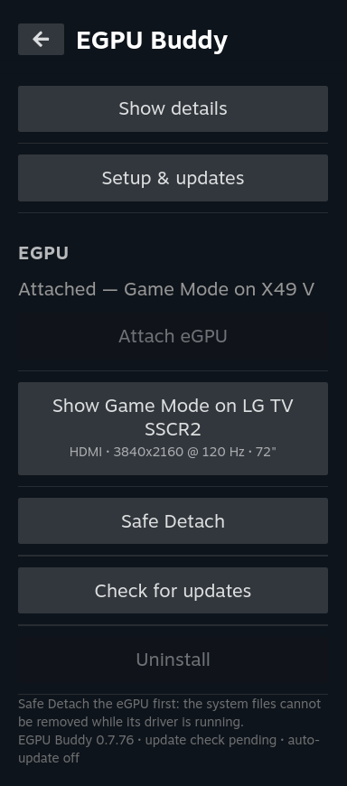
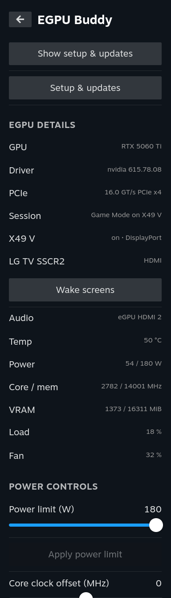

<p align="center">
  
</p>

# SteamOS EGPU Buddy

Use an eGPU with a Linux gaming handheld in **Game Mode**, the way it works on Windows: plug it in and Game Mode
moves to your monitor or TV; unplug it, safely or by pulling the cable, and it goes back to the handheld screen;
plug it in again and it comes back. It's all controlled from a Decky plugin in the Quick Access menu.

NVIDIA eGPUs are fully supported, including the fix for NVIDIA's Game Mode display glitches. AMD and Intel eGPUs
are supported in beta.

> **Use at your own risk.** This changes the NVIDIA driver, boot settings and the Game Mode session. It has been
> tested on two machines (below) and nothing else. Read [TESTED.md](TESTED.md) first, and keep a way to boot without
> the eGPU. Claude (Anthropic) and Codex (OpenAI) were used as development assistants.

## Features

- **Fixes NVIDIA's Game Mode display glitches:** no more striping, flicker or corrupted picture in Game Mode on
  NVIDIA cards (a gamescope fix built and shipped with the plugin).
- **Plug and play in Game Mode:** the eGPU is picked up automatically and Game Mode moves to its screen.
- **Safe Detach:** one button moves Game Mode back to the handheld screen; then unplug.
- **Cable pulls survive:** the handheld recovers to its own screen within seconds, and plugging in again re-attaches.
- **Multiple displays:** switch Game Mode between connected screens from the plugin. A new screen brings up a prompt,
  and each screen shows its name, port, resolution and refresh rate.
- **Best picture by default:** each screen's native resolution at its highest refresh rate.
- **Screens wake and switch input** where they support it (DDC/CI or HDMI-CEC).
- **GPU details and controls:** temperature, power, clocks, VRAM, power limit and clock offset.
- **Beta driver button:** try NVIDIA's newest driver, with an automatic return to the tested one if it fails.
- **Keeps itself working:** Decky restarts if it stops, and the setup repairs itself after OS updates.
- **Desktop app** with the same controls for the docked desktop.

## Screenshots

<p align="center">
  
  &nbsp;&nbsp;
  
</p>
<p align="center"><em>Main page (switch screens, Safe Detach) and details (GPU, screens, telemetry, power controls).</em></p>

## Tested hardware

| | Legion Go 2 | Legion Go 1 |
|---|---|---|
| OS | CachyOS (Deckify) | SteamOS 3.8 |
| eGPU | Gigabyte AORUS AI Box, RTX 5060 Ti | AOOSTAR AG03, RTX 3080 |
| Screens | Acer X49 ultrawide (DisplayPort), LG TV (HDMI) | Acer X49 ultrawide (DisplayPort) |

**NVIDIA:** RTX 30 and RTX 50 tested here; RTX 40 reported working by a user (RTX 4070). **AMD and Intel eGPUs:**
beta, not yet tested on real hardware. Reports are welcome. Details: [docs/TECHNICAL.md](docs/TECHNICAL.md).

## Install

**Keep the eGPU unplugged while installing and for the reboot after.** The protections it needs only take effect
after a reboot.

1. **From Game Mode (recommended):** with [Decky Loader](https://decky.xyz) installed, go to Decky settings →
   Developer → **Install plugin from URL**, and paste the `EGPU-Buddy-Decky-<version>.zip` link from
   [Releases](https://github.com/denver8989/SteamOS-EGPU-Buddy/releases). Open **EGPU Buddy** in the Quick Access
   menu, press **Install system integration**, then reboot.
2. **From the Desktop:** download `SteamOS-EGPU-Buddy-<version>.run` from
   [Releases](https://github.com/denver8989/SteamOS-EGPU-Buddy/releases), make it executable and run it, then reboot.
3. **One line in a terminal:**
   ```
   curl -fsSL https://raw.githubusercontent.com/denver8989/SteamOS-EGPU-Buddy/master/get-egpu-buddy.sh | bash
   ```

After the reboot, plug the eGPU in. Updates are offered in the plugin; automatic updates are off unless you turn
them on. Every release stays available on the Releases page.

## Reporting problems

Open an [issue](https://github.com/denver8989/SteamOS-EGPU-Buddy/issues) with your handheld, OS, eGPU and GPU, the
version (`cat /etc/nv-egpu-buddy/version`), and whether the eGPU was plugged in at boot or later. Logs worth
attaching are listed in [docs/TECHNICAL.md](docs/TECHNICAL.md#reporting-problems).

## Credits

This builds on other people's work. Full details, with links and licenses: [CREDITS.md](CREDITS.md).

- **matt-schwartz:** found the root cause of the NVIDIA Game Mode corruption.
- **NightHammer1000** and **antheas:** the gamescope fix this project builds.
- **NickNill, bdandy, roger-pmta:** the hot-unplug-safe NVIDIA driver patches.
- **Ilya Zlobintsev ([LACT](https://github.com/ilya-zlobintsev/LACT)):** the base of the GPU controls.
- **damianbienias32**, the **open-gpu-kernel-modules #979** contributors, **nikomiiller** and **Alex Forencich:** the
  USB4 link stability fixes.
- **ewagner12 ([all-ways-egpu](https://github.com/ewagner12/all-ways-egpu)):** the `boot_vga` technique used for
  AMD/Intel eGPUs.
- **Valve** (gamescope, Proton), **dxvk-nvapi**, **Decky Loader**, **CachyOS**, **Bazzite** and **NVIDIA**.

If your work is used here and isn't credited, open an issue and it will be fixed.

## More

- [docs/TECHNICAL.md](docs/TECHNICAL.md): how it works, OS updates, AMD/Intel details, kernel parameters.
- [TESTED.md](TESTED.md): what has been tested, and how.
- [docs/ROOT-CAUSES.md](docs/ROOT-CAUSES.md): the bugs behind the fixes.
- [RELEASE-NOTES.md](RELEASE-NOTES.md): what changed in each version.

## License

MIT for the scripts and documentation here. Vendored patches keep their upstream licenses (see
[CREDITS.md](CREDITS.md)).
